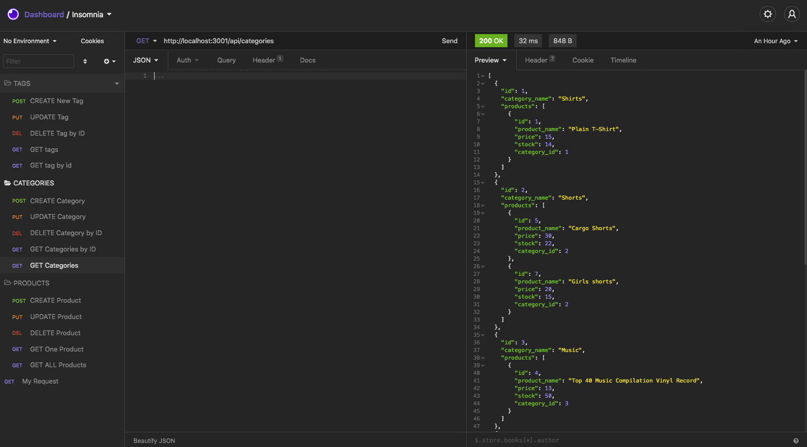

# E-Commerce Backend 

## Discription 

This application displays the backend of an E-Commerce site with the use of Express.js API to use Sequelize to interact with a MySQL database. This application will allow users to view all, Update, create and delete categories, products, and tags.

## Application Display  

View Application video - [Here](https://drive.google.com/file/d/1H9YDTW9-CjKE4CYnLbSNBcVsjjf2VwJt/view?usp=sharing)

Preview of Application:

## Usage & Installation 

This app will allow users to view all, Update, create and delete categories, products, and tags using routes

* Cloine repository using the ssh key below:
  "git@github.com:fasicasr/e-commerce-backend.git"
* Install dependencies - npm, express, squelize 
* Create database in MYSQL: (ecommerce_db)
* Run seed in terminal - npm run seed 
* Start running application - node server.js
* Once apil routes are properly implemented - run Insomnia to GET, POST, PUT, and DELETE(CRUD) the different routes. 

## Technologies 

* node.js
* npm 
* Sequelize
* Express.js
* MySQL

## License

Copyright © 2021 

## Questions 

* Github: https://github.com/fasicasr
* E-Commerce Backend repository: https://github.com/fasicasr/e-commerce-backend
* Email: Fasicasr@gmail.com
